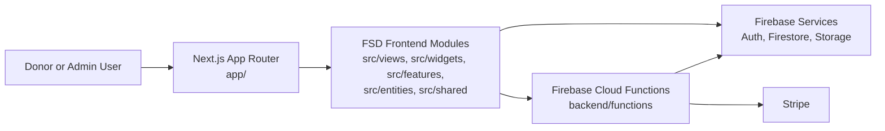
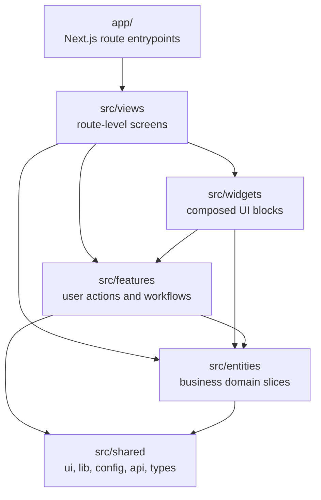
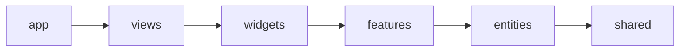
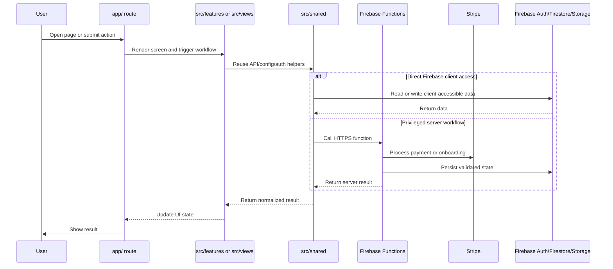
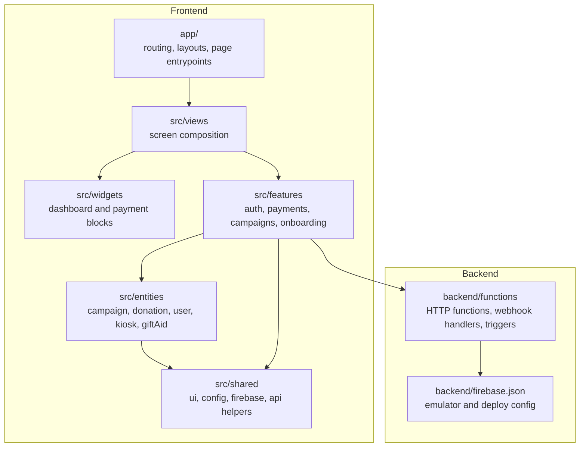

# SwiftCause Architecture Diagrams

This document provides a visual overview of how the SwiftCause codebase is organized today.

Use it alongside [docs/FSD/FSD_ARCHITECTURE.md](./FSD/FSD_ARCHITECTURE.md) for the detailed architectural rules.

## 1. High-Level System View

## 2. Frontend Layer Map

The active frontend is split between route entrypoints in `app/` and reusable FSD modules in `src/`.

## 3. Dependency Rule

Lower-level code must not depend on higher-level code.

Allowed imports flow from left to right only.

## 4. Runtime Request Flow

This is the common path for payment, auth, and admin actions.

## 5. Codebase Ownership Areas

## 6. Where To Start As A Contributor

- Route or page behavior: start in `app/`, then trace into `src/views`.
- Business workflow changes: start in `src/features`.
- Domain model or reusable business UI: start in `src/entities`.
- Shared infrastructure, Firebase setup, or API helpers: start in `src/shared`.
- Server-side payment, webhook, or admin logic: start in `backend/functions`.
