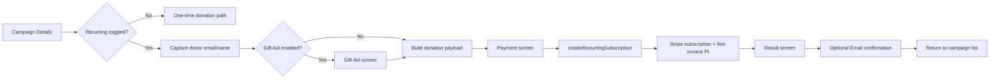
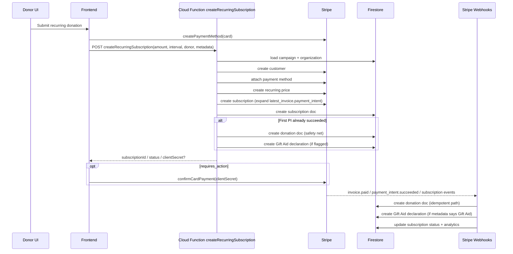

# Recurring Donation Flow (End-to-End)

This document explains the current recurring donation flow in the kiosk/web campaign journey, including:
- user journey across pages
- client state and `sessionStorage` usage
- backend function + webhook behavior
- where donor `email` and `name` should persist for autofill

## 1. Scope

This flow is based on the current implementation in:
- `app/campaign/[campaignId]/page.tsx`
- `src/features/kiosk-campaign-details/*`
- `app/payment/[campaignId]/page.tsx`
- `src/features/payment/hooks/usePayment.ts`
- `backend/functions/handlers/subscriptions.js`
- `backend/functions/handlers/webhooks.js`
- `app/result/page.tsx`
- `app/email-confirmation/page.tsx`

## 2. High-Level Journey

## 3. Current Client Flow (Step-by-Step)

## 3.1 Campaign Details (`/campaign/[campaignId]`)
- User chooses amount.
- If recurring is enabled:
  - user must enter valid email
  - name is optional
  - values are stored in `sessionStorage`:
    - `donorEmail`
    - `donorName`

## 3.2 Routing from Campaign Page
- If Gift Aid is enabled, route to same campaign page with query params:
  - `?amount=...&giftaid=true&from=details`
  - recurring params included when selected:
    - `&recurring=true&interval=monthly|quarterly|yearly`
- If Gift Aid disabled, donation object is built directly and saved:
  - `sessionStorage["donation"]`
  - `sessionStorage["paymentBackPath"]`
  - then route to `/payment/[campaignId]`

## 3.3 Gift Aid Page
- On accept:
  - donation payload includes recurring flags + `donorEmail` from `sessionStorage`
  - donor name is set from Gift Aid name fields
  - writes:
    - `sessionStorage["donation"]`
    - `sessionStorage["giftAidData"]`
    - `sessionStorage["paymentBackPath"]`
  - route to payment
- On decline:
  - donation payload includes recurring flags + donor values from `sessionStorage`
  - writes `donation` + `paymentBackPath`
  - route to payment

## 3.4 Payment Page (`/payment/[campaignId]`)
- Reads `sessionStorage["donation"]`.
- Builds metadata for Stripe:
  - `campaignId`, `campaignTitle`, `organizationId`
  - `isRecurring`, `recurringInterval`
  - `donorEmail`, `donorName`, `donorPhone`
  - Gift Aid metadata fields when present
- If recurring:
  - frontend creates card payment method
  - calls backend `createRecurringSubscription`

## 3.5 Result + Email Confirmation
- Payment result saved in `sessionStorage["paymentResult"]`.
- Result screen can route to email confirmation.
- Email confirmation currently asks for email again (manual input).
- End-of-flow cleanup currently removes:
  - `donation`
  - `paymentResult`

## 4. Backend Recurring Flow

## 5. Data + State Map

## 5.1 In-Memory/UI State
- `isRecurring`
- `recurringInterval`
- `donorEmail`
- `donorName`
- selected/custom amount

## 5.2 `sessionStorage` Keys (Current)
- `donorEmail`: recurring donor email
- `donorName`: recurring donor name
- `donation`: checkout payload passed to payment page
- `giftAidData`: Gift Aid form payload
- `completeGiftAidData`: temporary backup before payment submit
- `paymentBackPath`: back-navigation path from payment page
- `paymentResult`: success/failure result for result screen

## 5.3 Firestore Collections (Recurring Relevant)
- `subscriptions`
- `donations`
- `giftAidDeclarations`

## 6. Where Name/Email Should Persist for Autofill

For a frictionless recurring journey, the same donor identity fields should be reused:
- Recurring panel input (source): `email`, `name`
- Gift Aid details form:
  - autofill full name from recurring name when available
  - user can still edit
- Email confirmation screen:
  - autofill email from recurring email when available
  - user can still edit
- Return to campaign after payment:
  - pre-populate recurring email/name fields so donor does not retype

## 7. Current Gaps to Note

- Campaign recurring inputs are saved to `sessionStorage`, but campaign details state does not currently auto-load them on page init.
- Email confirmation screen currently starts with empty email input.
- Gift Aid full-name field currently does not auto-seed from recurring `donorName`.
- Cleanup removes `donation`/`paymentResult`, but `donorEmail`/`donorName` persistence lifecycle is not clearly controlled (risk of stale or missing data depending on navigation).

## 8. Recommended Persistence Contract

Use a single draft object in `sessionStorage`, for example:
- key: `recurringDonorDraft`
- shape:
  - `campaignId`
  - `donorEmail`
  - `donorName`
  - `updatedAt`

Rules:
1. Update on every email/name change in recurring panel.
2. Hydrate campaign recurring form from this key on page load.
3. Pass values into Gift Aid + Email Confirmation as initial values.
4. Keep fields editable; edits overwrite the same draft.
5. Clear draft when donation session is explicitly finished (or expire by `updatedAt` TTL).
6. Scope by `campaignId` to avoid cross-campaign leakage.

## 9. Autofill Behavior Matrix

| Screen | Field | Source | Editable |
|---|---|---|---|
| Campaign Details (Recurring) | Email | `recurringDonorDraft.donorEmail` | Yes |
| Campaign Details (Recurring) | Name | `recurringDonorDraft.donorName` | Yes |
| Gift Aid Details | Full Name | `recurringDonorDraft.donorName` | Yes |
| Email Confirmation | Email | `recurringDonorDraft.donorEmail` | Yes |

## 10. Quick Verification Checklist

- Start recurring donation, enter email/name, navigate forward and back: values remain.
- Accept/decline Gift Aid: donor details still present in payment metadata.
- Complete payment and return: recurring fields prefilled on campaign screen.
- Email confirmation input is prefilled with donor email.
- Switch to another campaign: previous campaign donor draft does not leak.
